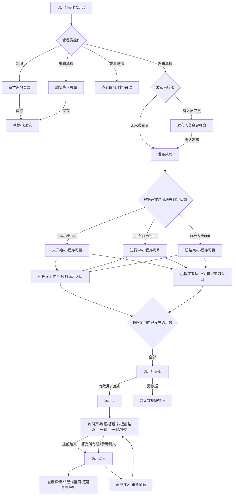
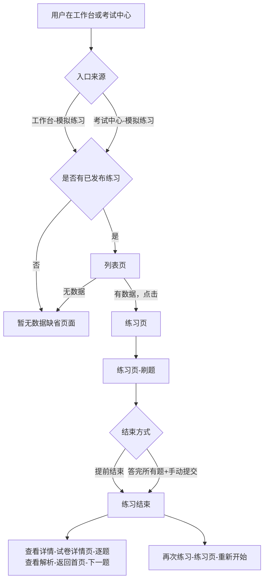
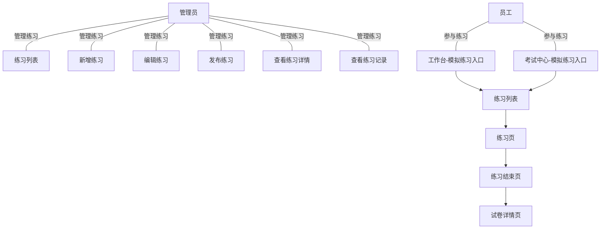
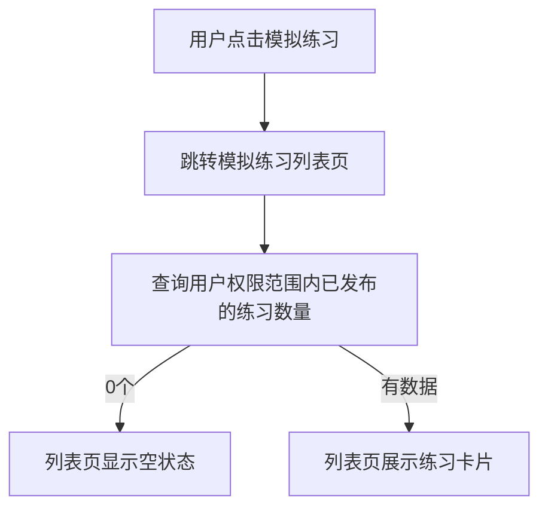
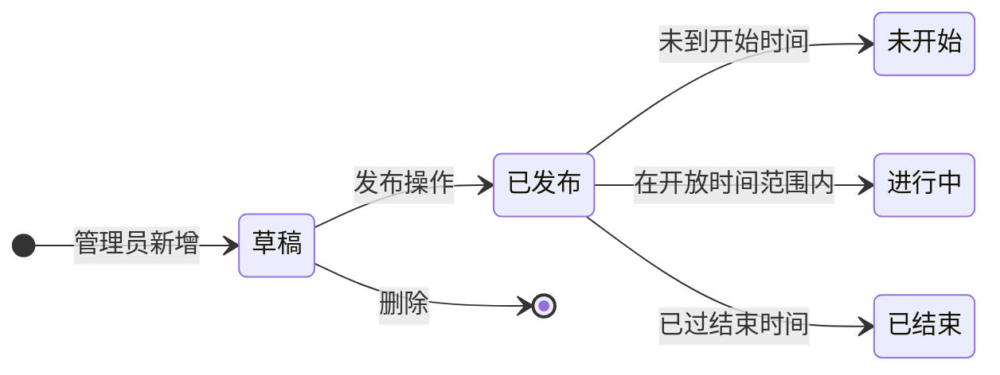
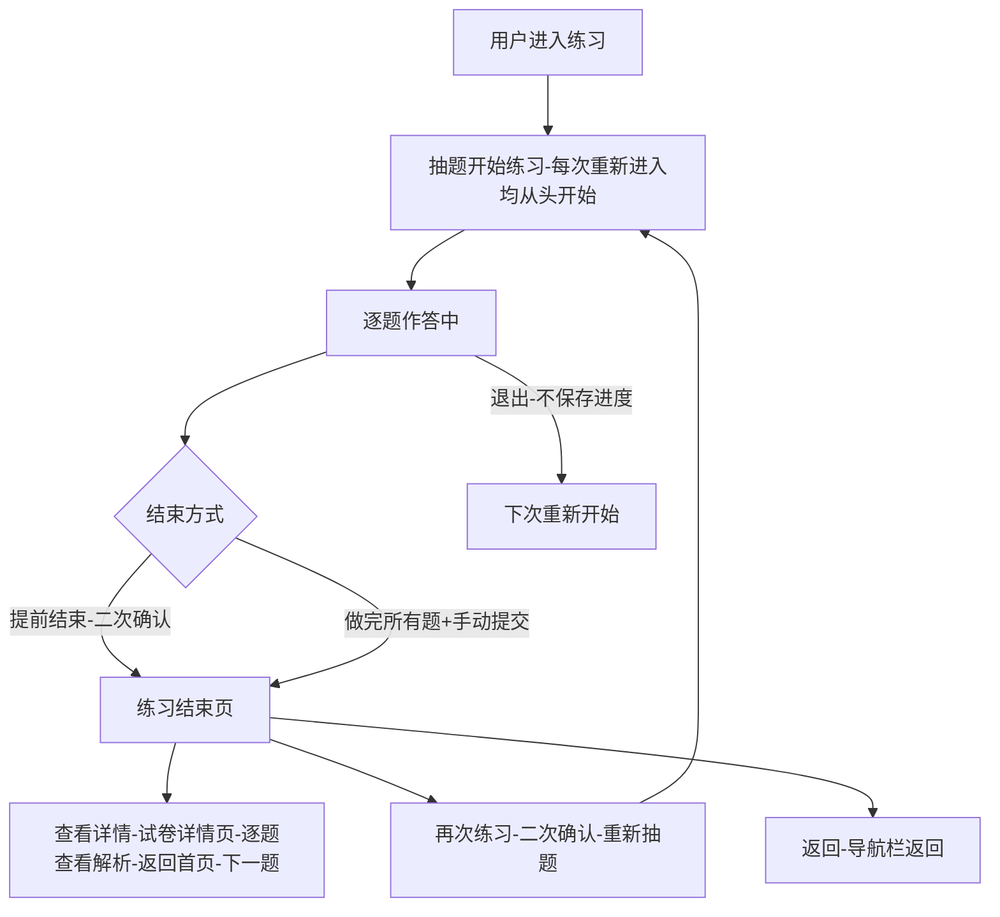

# 练习功能整体 PRD

---

## 1. 业务背景

环慧慧 EHS+ 系统原先仅支持**按专业类型进行自由练习**，用户根据自身专业从通用题库 + 专业题库中随机抽题练习。

本次新增**模拟练习**模式：管理员选择关联标准试卷，按试卷结构配置练习参数（题目总数、各题型数量、练习开放时间、练习人员），模拟练习支持灵活划定题目范围，进行针对性强化训练，适用于考前冲刺与阶段性能力评估。员工在小程序端抽题练习，达到考前巩固和冲刺的目的。

原有专业练习模式保持不变，两种模式并存。

---

## 2. 角色与权限

| 角色 | PC 后台-查看 | PC 后台-新增/编辑/删除 | PC 后台-发布 | 小程序-查看列表 | 小程序-进入练习 |
|------|:--:|:--:|:--:|:--:|:--:|
| 管理员 | ✓ | ✓ | ✓ | ✗ | ✗ |
| 平台员工 | ✗ | ✗ | ✗ | ✓ | ✓ |

> **说明**：管理员在 PC 后台管理练习配置；员工仅在小程序端参与练习。

---

## 3. 核心流程图

### 3.1 整体业务流



### 3.2 小程序端练习流程



---

## 4. 名词解释

| 术语 | 定义 |
|------|------|
| **模拟练习** | 新增的练习模式，管理员选择关联标准试卷，按试卷结构配置题目数量和练习人员，支持灵活划定题目范围进行针对性强化训练，适用于考前冲刺与阶段性能力评估。员工在小程序端刷题 |
| **专业练习（自由练习）** | 已有模式，用户按自身专业从通用题库+专业题库随机抽题练习，不受试卷限制 |
| **草稿** | 未发布的练习配置，仅 PC 后台可见，小程序端不可见 |
| **已发布** | 已发布的练习配置，小程序端可见。根据开放时间进一步显示为：未开始 / 进行中 / 已结束 |
| **未开始** | 已发布且当前时间 < 开始时间，小程序端可见但不可进入练习 |
| **进行中** | 已发布且开始时间 ≤ 当前时间 ≤ 结束时间，小程序端可正常进入练习 |
| **已结束** | 已发布且当前时间 > 结束时间，小程序端可见但不可进入练习 |
| **开放时间** | 练习集中可用的时间窗口（开始时间 至 结束时间），仅在开放时间内的进行中练习可进入 |

---

## 5. 用例图



---

## 6. 页面清单

| # | 页面 | 端侧 | 类型 | 功能说明 |
|---|------|------|------|---------|
| 1 | 练习列表 | PC 后台 Web | 新增 | 展示模拟练习列表，支持新增、发布、编辑、详情、删除；草稿行操作顺序为发布、编辑、详情、删除 |
| 2 | 新增练习 | PC 后台 Web | 新增 | 独立新增页面，配置基本信息、选择试卷、练习题目数量、练习人员；保存后为草稿 |
| 3 | 编辑练习 | PC 后台 Web | 新增 | 独立编辑页面，仅草稿可进入；支持人员范围回显、分页选择、一键清理离职人员 |
| 4 | 查看练习详情 | PC 后台 Web | 新增 | 从练习列表进入，只读展示练习配置；人员和共计人数以发布时快照为准 |
| 5 | 试卷选择弹窗 | PC 后台 Web | 已有 | 单选试卷 |
| 6 | 人员选择弹窗 | PC 后台 Web | 已有 | 支持部门、岗位、人员多选与分页 |
| 7 | 小程序工作台 | 小程序 | 优化 | 新增「模拟练习」入口卡片 |
| 8 | 小程序考试中心 | 小程序 | 优化 | 原有页面，本次在快捷入口区新增「模拟练习」入口图标 |
| 9 | 小程序练习列表 | 小程序 | 新增 | 展示已发布的模拟练习卡片列表 |
| 10 | 小程序练习页面 | 小程序 | 新增 | 抽题 + 逐题作答 + 答题卡半屏弹窗 + 提前结束确认 |
| 11 | 小程序练习结束页面 | 小程序 | 新增 | 练习结果统计（正确率环形图、答题数/答对数）+ 答题卡回顾 + 操作入口 |
| 12 | 小程序试卷详情页面 | 小程序 | 新增 | 逐题查看详情（答案、解析）+ 题目进度条 |
| 13 | 练习记录 | PC 后台 Web | 优化 | 原有仅支持自由练习模式，现兼容模拟练习模式。展示用户练习统计记录（姓名、部门、专业、练习模式、练习次数/题数、首次/上次时间），支持筛选与导出 |

---

## 7. 页面详细设计

### 7.1 PC 后台 - 练习列表

> 📄 **详见页面PRD**：[练习列表_PRD.md](./练习列表_PRD.md)

**位置**：练习列表

**列表字段**：

| 列 | 说明 |
|----|------|
| 练习名称 | 单行展示，≤20 字 |
| 开始时间 | 练习开放开始时间 |
| 结束时间 | 练习开放结束时间 |
| 状态 | 草稿 / 未开始 / 进行中 / 已结束 |
| 创建人 | 创建者姓名 |
| 创建时间 | 年-月-日 时:分:秒 |
| 操作 | 全部状态：详情<br>草稿：发布 + 编辑 + 详情 + 删除<br>未开始 / 进行中 / 已结束：详情 |

**排序**：按创建时间倒序（最新在前）

**空状态**：显示「暂无数据」

**操作规则**：

| 操作 | 说明 |
|------|------|
| 发布 | 仅草稿状态显示。发布前校验开放时间；校验通过后检测人员变更。无变更时直接提示「发布成功」；有变更时展示发布弹窗，确认后发布 |
| 编辑 | 仅草稿状态显示，点击进入独立编辑练习页面 |
| 详情 | 全部状态显示，进入只读详情页；人员和人数以发布时快照为准，发布后离职、停用、转部门、转岗位或新进入范围均不改变详情人数 |
| 删除 | 仅草稿状态显示，弹出确认弹窗「确定要删除该练习吗？此操作不可恢复。」；确认后提示「删除成功」 |

**发布人员变更检测**：

| 变更类型 | 触发场景 | 展示规则 |
|----------|----------|----------|
| 移除 | 练习对象中的人员列表存在离职或停用人员 | 展示系统即将移除的人员列表和数量 |
| 移除 | 练习对象为部门范围，存在离职、停用或转出部门人员 | 展示系统即将移除的人员列表和数量 |
| 移除 | 练习对象为岗位范围，存在离职、停用或转出岗位人员 | 展示系统即将移除的人员列表和数量 |
| 新增 | 练习对象为部门范围，存在转入部门或启用人员 | 展示新进入练习对象的人员列表和数量 |
| 新增 | 练习对象为岗位范围，存在转入岗位或启用人员 | 展示新进入练习对象的人员列表和数量 |

发布弹窗展示全部、移除、新增页签；表格字段为序号、姓名、部门、操作类型；离职和停用人员均标注「（离职）」。

**状态说明**：

| 状态 | 发布状态 | 判定条件 |
|------|:------:|------|
| 草稿 | 未发布 | 未发布 |
| 未开始 | 已发布 | 已发布，当前时间 < 开始时间 |
| 进行中 | 已发布 | 已发布，开始时间 ≤ 当前时间 ≤ 结束时间 |
| 已结束 | 已发布 | 已发布，当前时间 > 结束时间 |

### 7.2 PC 后台 - 新增练习

> 📄 **详见页面PRD**：[新增练习_PRD.md](./新增练习_PRD.md)

**表单分组**：

新增练习为独立页面，表单分为 4 个分组，从上到下依次为：

| 分组 | 说明 |
|------|------|
| 基本信息 | 练习名称 + 练习开放时间 |
| 选择试卷 | 试卷选择器 + 试卷结构信息 |
| 练习题目数量 | 题目总数 + 各题型数量，未选择试卷前全部禁用 |
| 练习人员 | 部门、岗位、人员选择器 |

**字段**：

| 字段 | 控件 | 必填 | 默认值 | 说明 |
|------|------|:--:|--------|------|
| 练习名称 | 文本输入框 | ✓ | 空 | ≤20 字，带字数计数 |
| 练习开放时间 | 日期时间范围选择 | ✓ | 空 |「开始时间 至 结束时间」，员工可在开放时间内进行练习 |
| 选择试卷 | 系统试卷选择器（弹窗单选） | ✓ | 空 | 选择后展示试卷结构信息 |
| 练习题目总数 | 数字输入 + 单位「道」 | ✓ | 空（禁用状态） | 选择试卷后自动启用，上限为试卷题目总数 |
| 各题型数量 | 复选框 + 数字输入 | ✓ | 空（禁用状态） | 选择试卷后自动启用，各题型上限为试卷对应类型数量，显示汇总 (N / 总题数) |
| 练习人员 | 人员选择弹窗（多选） | ✓ | - | 支持选择部门、岗位、人员；已选内容按类型分组展示，每组最多直接展示 10 项，超过后展示「查看更多X项」按钮 |

**练习人员展示与抽屉**：

- 部门、岗位、人员分别展示为「部门（X个）」「岗位（X个）」「人员（X个）」。
- 每组最多直接展示 10 项，超过 10 项时展示「查看更多X项」。
- 点击「查看更多X项」打开右侧已选列表抽屉。
- 已选部门抽屉支持按部门名称查询；已选岗位抽屉支持按岗位名称查询；已选人员抽屉支持按姓名、部门名称查询。
- 抽屉支持查询、重置、删除、批量删除；未选择批量项时提示「请选择要批量操作的内容」。

**底部按钮**：

新增模式 / 草稿编辑模式：

| 按钮 | 行为 |
|------|------|
| 返回 | 关闭弹窗，不保存 |
| 保存 | 校验通过后保存为草稿，提示「练习已保存成功，您可以通过点击「发布」按钮完成发布」 |

> 发布操作统一在练习列表行中点击「发布」完成。

### 7.3 PC 后台 - 编辑练习

> 📄 **详见页面PRD**：[编辑练习_PRD.md](./编辑练习_PRD.md)

编辑练习为独立页面，仅草稿状态可进入，回填已有练习配置。

**编辑规则**：

| 模块 | 规则 |
|------|------|
| 基本信息 | 回填练习名称、开放时间，可修改 |
| 选择试卷 | 回填已选试卷，可重新选择 |
| 练习题目数量 | 回填题目总数与各题型数量，可修改 |
| 练习人员 | 回填已选部门、岗位、人员；部门/岗位范围按当前组织重新计算人数 |

**离职人员处理**：

- 已选人员中存在离职人员时，在人员标签中标注「（离职）」。
- 「一键清理离职人员」按钮展示在「人员（X个）」后。
- 点击后一键移除已选人员中的离职人员，并提示「已清理X位离职人员」。
- 清理提示仅展示一个顶部 tip，自动消失。
- 已选人员抽屉同样支持一键清理离职人员，并支持按部门查询。

**编辑页人员展示与新增页保持一致**：

- 部门、岗位、人员每组最多直接展示 10 项。
- 超过 10 项展示「查看更多X项」按钮。
- 点击后打开右侧已选列表抽屉。
- 人员选择弹窗支持分页，部门、岗位、人员数据超过 10 条时展示分页。

### 7.4 PC 后台 - 查看练习详情

详情从练习列表进入，全部状态均可查看。详情页样式与新增练习页面保持一致，但全部字段只读，不支持编辑。

| 模块 | 只读规则 |
|------|----------|
| 基本信息 | 练习名称、开放时间只读 |
| 选择试卷 | 展示试卷名称和试卷结构信息，不可重新选择 |
| 练习题目数量 | 总数和各题型数量只读 |
| 练习人员 | 添加人员按钮隐藏，标签不可移除 |

**详情页人员规则**：

- 详情页人员和共计人数以发布时人员快照为准。
- 发布后发生离职、停用、转部门、转岗位，或有人员新进入部门/岗位范围，均不再修改详情页人数。
- 练习人员区域仅展示已选标签和「查看更多X项」入口。
- 部门、岗位、人员每组最多直接展示 10 项，超过后展示「查看更多X项」。
- 点击「查看更多X项」打开右侧抽屉；抽屉只用于查看和查询，不展示复选框、批量删除、移除按钮。

**底部按钮**：

| 按钮 | 行为 |
|------|------|
| 返回 | 返回列表，不修改任何数据 |

**新增/编辑保存校验规则（依次执行）**：

1. 练习名称必填 →「请输入练习名称」
2. 试卷必选 →「请选择试卷」
3. 练习开放时间必须完整填写 →「请填写完整的练习开放时间」
4. 结束时间 > 开始时间 →「结束时间必须大于开始时间」
5. 新增时开始时间 > 当前时间 →「开始时间必须大于当前时间」（编辑时若已开始的练习不可修改开始时间）
6. 题目总数 > 0 →「请输入有效的题目总数」
7. 总数 ≤ 试卷题目总数 →「题目总数不能超过试卷题目总数（N 道）」
8. 至少选一种题型 →「请至少选择一种题目类型」
9. 各题型之和 = 总数 →「各题型数量之和需等于题目总数」
10. 各题型数量 ≤ 试卷对应类型上限 →「不能超过试卷单选/多选/判断题数量（N 道）」
11. 练习人员必填，须至少添加一个人员或部门 →「请至少添加一个人员或部门」

### 7.5 小程序工作台 - 新增入口

> 📄 **详见页面PRD**：[小程序工作台页面_PRD.md](./小程序工作台页面_PRD.md)

**入口卡片**：在「学习管理」区块的 4 列图标网格中，新增第 4 个入口「模拟练习」：

| 属性 | 值 |
|------|----|
| 标签文字 | 模拟练习 |
| 点击行为 | 跳转至模拟练习列表页 |

**路由逻辑**：



> "用户权限范围"是指练习的指定人员列表约束，仅指定人员范围内的用户可见该练习。

### 7.6 小程序考试中心 - 新增模拟练习入口

> 📄 **详见页面PRD**：[小程序考试中心_PRD.md](./小程序考试中心_PRD.md)

考试中心为**已有页面**，是员工查看考试任务与进入练习的入口页。本次仅在顶部快捷入口区新增「模拟练习」入口图标。

**快捷入口（变更后，共 4 个）**：

| 入口 | 点击行为 | 状态 |
|------|---------|:----:|
| 自由练习 | 跳转自由练习刷题页 | 已有 |
| **模拟练习** | **跳转模拟练习列表** | **新增** |
| 学习积分 | 查看学习积分 | 已有 |
| 排行榜 | 查看排行榜 | 已有 |

**页面入口**：工作台「考试中心」图标 → 跳转考试中心页面。

### 7.7 小程序模拟练习列表

> 📄 **详见页面PRD**：[小程序练习列表_PRD.md](./小程序练习列表_PRD.md)

**页面结构**：

```
┌────────────────────────────┐
│  ← 模拟练习                 │  导航栏
├────────────────────────────┤
│                            │
│  模拟练习 (N)              │  ← 标题+数量
│  ┌──────────────────────┐ │
│  │ 练习名称    [状态标签]  │ │
│  │ ⏰ 开放时间 xx ~ xx   │ │  ← 试卷卡片
│  │        [前往练习]     │ │
│  └──────────────────────┘ │
│  ┌──────────────────────┐ │
│  │ ...                  │ │
│  └──────────────────────┘ │
│                            │
└────────────────────────────┘
```

**卡片信息**：

| 元素 | 说明 |
|------|------|
| 练习名称 | 管理后台配置的名称，单行截断 |
| 状态标签 | 未开始 / 进行中 / 已结束 |
| 开放时间 | 开始时间 ~ 结束时间 |
| 前往练习按钮 | 仅在「进行中」状态显示 |

**排序**：按创建时间倒序（最新在前）

**交互**：
- 点击「进行中」卡片 → 进入该练习页
- 点击「未开始」或「已结束」卡片 → 不跳转（或提示「当前不可练习」）
- 返回按钮 → 使用 `history.back()` 返回上一页面（工作台或考试中心）

### 7.8 小程序练习页（核心页面）

> 📄 **详见页面PRD**：[小程序练习页面_PRD.md](./小程序练习页面_PRD.md)

**页面结构**：

```
┌────────────────────────────┐
│  ← 练习名称            进度  │  导航栏
├────────────────────────────┤
│  ████████░░░░░░░░  50%     │  进度条
├────────────────────────────┤
│                            │
│  单选题                     │  题型标签
│                            │
│  ┌──────────────────────┐ │
│  │ 题目内容 ...          │ │
│  │                      │ │  题目区域
│  │ ● 选项A              │ │
│  │ ○ 选项B              │ │
│  │ ○ 选项C              │ │
│  │ ○ 选项D              │ │
│  └──────────────────────┘ │
│                            │
├────────────────────────────┤
│ [答题卡] [提前结束] [上一题] [下一题/提交] │  底部操作栏（固定）
└────────────────────────────┘
```

**底部操作栏**：

| 按钮 | 位置 | 行为 |
|------|------|------|
| 答题卡 | 最左 | 打开半屏答题卡弹窗 |
| 提前结束 | 左二 | 弹出二次确认弹窗 → 确定跳转练习结束页 |
| 上一题 | 右二 | 回到上一题（首题不可用） |
| 下一题/提交 | 最右 | 保存当前答案 → 进入下一题；最后一题时按钮变为「提交」，点击后跳转练习结束页 |

**提前结束确认弹窗**：

```
┌─────────────────────┐
│                     │
│       提示          │  标题
│ 你还有未完成试题，    │  描述
│ 确定要交卷吗？      │
│                     │
├─────────────────────┤
│       确定          │
├─────────────────────┤
│       取消          │
└─────────────────────┘
```

- 确定 → 跳转「练习结束页面」
- 取消 → 关闭弹窗

**答题卡弹窗**（半屏底部弹出）：

```
┌────────────────────────────────┐
│  ——                            │
│  答题卡                    ✕   │
├────────────────────────────────┤
│  ■ 已做    □ 未做              │  图例
├────────────────────────────────┤
│  ┌──┬──┬──┬──┬──┬──┬──┐     │
│  │1 │2 │3 │4 │5 │6 │7 │     │  网格（7列）
│  ├──┼──┼──┼──┼──┼──┼──┤     │  已做/未做
│  │8 │9 │10│11│12│13│14│     │
│  └──┴──┴──┴──┴──┴──┴──┘     │  可滚动
│                                │
└────────────────────────────────┘
```

| 属性 | 值 |
|------|----|
| 标题 | 答题卡 |
| 最大高度 | 半屏 |
| 网格 | 7 列 |
| 图例 | 已做 / 未做 |
| 交互 | 点击题号跳转到对应题目，当前题高亮 |
| 滚动 | 内容区域独立滚动，标题和图例固定 |

**核心交互**：

| 操作 | 行为 |
|------|------|
| 进入页面 | 获取下一题 |
| 选择答案 | 记录选项，选项高亮 |
| 上一题 | 回看之前题目，可修改答案，首题时按钮置灰 |
| 下一题/提交 | 提交当前题，获取下一题；最后一题时显示「提交」，点击后跳转练习结束页 |
| 答题卡 | 底部弹窗展示所有题目作答状态，可点击跳转 |
| 提前结束 | 弹出确认弹窗「提示 / 你还有未完成试题，确定要交卷吗？」，确认后跳转练习结束页 |

**结束条件**：
- **提前结束**：用户点击「提前结束」→ 二次确认 → 结束
- **做完提交**：做完配置的总题数道题后，最后一题的「下一题」按钮变为「提交」，用户须点击「提交」方可结束，不会自动跳转

**试卷删除兼容**：
- **试卷删除不影响练习**：题目数据在用户进入练习时已从关联试卷中抽取并落库存储，原试卷删除不影响已创建的练习功能与已进入的练习答题。

### 7.9 小程序练习结束页面

> 📄 **详见页面PRD**：[小程序练习结束页面_PRD.md](./小程序练习结束页面_PRD.md)

练习结束后展示本轮结果统计与答题回顾。

**页面结构**：

```
┌────────────────────────────┐
│  ← 返回    练习结果          │  导航栏
├────────────────────────────┤
│                            │
│     专业名称（如 EHS+）      │
│                            │
│        ╭──────╮            │
│        │ 60% │            │  环形进度图
│        │正确率│            │  环形图
│        ╰──────╯            │
│                            │
│  答题总数：100  答对数量：60  │  统计数据
│                            │
│   接近全对，再努力一点...    │  鼓励语（根据正确率，3档）
│                            │
├────────────────────────────┤
│  答题卡                     │
│  ■ 答对(60) ■ 答错(35) □ 未做(5) │  图例 + 数量
│  ┌──┬──┬──┬──┬──┐       │
│  │1 │2 │3 │4 │5 │ ...  │  5列网格
│  └──┴──┴──┴──┴──┘       │  绿=答对/红=答错/灰=未做
│  共 100 题                 │
│                            │
├────────────────────────────┤
│  [查看详情]    [再次练习]    │  底部操作栏（固定）
└────────────────────────────┘
```

**环形进度图**：
| 属性 | 值 |
|------|----|
| 正确率 | 环形图绘制，中心显示百分比数字 |
| 颜色分档 | 按正确率分三档显示 |

**统计数据**：
| 字段 | 示例值 |
|------|--------|
| 答题总数 | 100 |
| 答对数量 | 60 |

**鼓励语**（根据正确率，3档）：
| 正确率 | 文案 |
|--------|------|
| 100% | 全对！你太棒了，继续保持！ |
| ≥60% | 接近全对，再努力一点，下次完美！ |
| <60% | 别灰心，总结经验，反复练习！ |

**答题卡**：
| 属性 | 值 |
|------|----|
| 网格 | 5 列 |
| 图例 | 显示各状态数量，如「答对(60) · 答错(35) · 未做(5)」 |

**底部按钮**：
| 按钮 | 行为 |
|------|------|
| 查看详情 | 跳转「试卷详情页面」 |
| 再次练习 | 弹出二次确认「确定重新练习吗？」→ 确定跳转练习页面 |

**再次练习确认弹窗**：
```
┌─────────────────────┐
│                     │
│       提示          │
│ 确定重新练习吗？     │
│                     │
├─────────────────────┤
│       确定          │
├─────────────────────┤
│       取消          │
└─────────────────────┘
```

> 底部操作栏固定显示。

### 7.10 小程序试卷详情页面

> 📄 **详见页面PRD**：[小程序试卷详情页面_PRD.md](./小程序试卷详情页面_PRD.md)

从练习结束页点击「查看详情」进入，逐题展示答案与解析。

**页面结构**：

```
┌────────────────────────────┐
│  ← 返回    试卷详情          │  导航栏
├────────────────────────────┤
│  题目进度              1/4  │
│  ████████░░░░░░░░░░░░ 25%  │  进度条
├────────────────────────────┤
│                            │
│  ┌──────────────────────┐ │
│  │ 1. 单选题    ✓答对    │ │  题号 + 题型标签 + 状态
│  │                      │ │
│  │ 安全生产第一责任人是？  │ │  题目内容
│  │                      │ │
│  │ ✓ A. 企业主要负责人    │ │  正确选项
│  │   B. 安全管理人员      │ │  未选选项
│  │   C. 班组长           │ │
│  │   D. 普通员工          │ │
│  │                      │ │
│  │ 正确答案：A            │ │
│  │ 我的答案：A            │ │
│  │                      │ │
│  │ ┌─解析─────────────┐ │ │
│  │ │ 根据《安全生产法》  │ │ │  解析框
│  │ └─────────────────┘ │ │
│  └──────────────────────┘ │
│                            │
├────────────────────────────┤
│    [返回首页]   [下一题]     │  底部操作栏（固定）
└────────────────────────────┘
```

**进度模块**：
| 元素 | 说明 |
|------|------|
| 标签 | 「题目进度」 |
| 计数器 | 当前题号 / 总题数 |
| 进度条 | 按 (当前题 / 总题数) 比例填充 |

**题目卡片**：
| 元素 | 说明 |
|------|------|
| 题号 + 题型标签 | 题号 + 类型标签（单选/多选/判断） |
| 状态标签 | 答对 / 答错 |
| 选项 | 正确答案标记 / 错选标记 / 未选 |
| 正确答案 | 展示正确答案 |
| 我的答案 | 展示我的答案 |
| 解析 | 解析区域 |

**底部按钮**：
| 按钮 | 行为 |
|------|------|
| 返回首页 | 跳转「工作台」页面 |
| 下一题 | 切换到下一题；最后一题禁用并显示「已是最后一题」 |

**分页逻辑**：一题一页，通过「下一题」按钮切换，实时更新进度条和计数器。

> 底部操作栏固定显示。

### 7.11 PC 后台 - 练习记录

> 📄 **详见页面PRD**：[练习记录_PRD.md](./练习记录_PRD.md)

**位置**：EHS 教育 → 考试中心 → 练习记录（已有页面，本次兼容模拟练习模式）

**当前状态**：该页面已存在，仅支持自由练习模式的记录。本次需兼容模拟练习模式，新增练习模式筛选列与列表列。

**页面布局**（参考截图）：

```
┌────────────────────────────────────────────────────────────┐
│ EHS教育 > 安全首页 > 练习记录                                │
├────────────────────────────────────────────────────────────┤
│                                                            │
│  姓名: [请输入      ]  专业: [请选择专业 ▼]  部门: [请选择 ▼]  │  筛选区域
│                                                      [查询] [重置] │
│                                                            │
├────────────────────────────────────────────────────────────┤
│  [导出]                                                    │  操作按钮
├────────────────────────────────────────────────────────────┤
│  姓名 │ 部门 │ 所属专业 │ 练习次数 │ 练习题数 │ 首次练习时间 │ 上次练习时间 │ ⚙️ │  表格
│  ─────┼──────┼─────────┼─────────┼──────────┼─────────────┼─────────────┼───┤
│  张三 │ 采购部1 │ 蛋黄子   │ 1       │ 4        │ 2025-08-25...│ 2025-08-25...│   │
│  ...  │ ...  │ ...     │ ...     │ ...      │ ...          │ ...          │   │
│                                                            │
├────────────────────────────────────────────────────────────┤
│  共 12 条    15条/页  ▼   [ < ] [ 1 ] [ > ]  前往 [ 1 ] 页   │  分页
└────────────────────────────────────────────────────────────┘
```

**筛选条件**：

| 筛选项 | 类型 | 说明 |
|--------|------|------|
| 姓名 | 文本输入 | 模糊搜索，placeholder「请输入」 |
| 专业 | 下拉选择 | 按所属专业筛选，placeholder「请选择专业」 |
| 部门 | 下拉选择 | 按部门筛选，placeholder「请选择」 |

**筛选区域按钮**：

| 按钮 | 样式 | 行为 |
|------|------|------|
| 查询 | 蓝色主按钮 | 根据当前筛选条件刷新列表 |
| 重置 | 边框按钮 | 清空所有筛选条件，重置后自动查询 |

**表格操作**：

| 按钮 | 样式 | 行为 |
|------|------|------|
| 导出 | 绿色按钮 | 将当前筛选条件下的记录导出为文件（Excel） |
| 列设置 | 表格右上角 ⚙️ 图标 | 点击可自定义展示/隐藏表格列，支持拖拽排序 |

**列表字段**：

| 列 | 说明 | 备注 |
|----|------|------|
| 姓名 | 员工姓名 | 空值显示「-」 |
| 部门 | 所属部门 | - |
| 所属专业 | 员工专业方向 | 空值显示「-」 |
| 练习次数 | 累计参与练习的次数 | 数字，右对齐 |
| 练习题数 | 累计完成的题目总数 | 数字，右对齐 |
| 首次练习时间 | 第一次参与练习的时间 | 格式：YYYY-MM-DD HH:mm:ss |
| 上次练习时间 | 最近一次参与练习的时间 | 格式：YYYY-MM-DD HH:mm:ss |

**分页**：

| 属性 | 值 |
|------|----|
| 默认每页条数 | 15 条（参考截图） |
| 可选每页条数 | 15 / 20 / 50 / 100 |
| 页码展示 | 上一页 / 页码 / 下一页 |
| 快捷跳转 | 支持「前往第 X 页」输入跳转 |
| 总条数展示 | 底部显示「共 N 条」 |

**数据保留规则**：
- 仅记录已完成提交的练习结果，未提交的练习不计入。
- **试卷删除不影响练习记录**：已记录的练习数据与试卷解耦，试卷删除后历史记录仍保留。\n

---

## 8. 状态流转

### 8.1 练习配置生命周期



### 8.2 用户练习生命周期



> **说明**：不记录轮次，未提交完成的练习不保留答题记录，用户每次进入练习均从头开始重新抽题。

---

## 9. 非功能性需求

| 类别 | 要求 |
|------|------|
| 性能 | 列表页加载 ≤ 1.5s，练习页首题加载 ≤ 1s |
| 可用性 | 数据按组织隔离，用户仅可见权限范围内的练习 |
| 兼容性 | 小程序端：iOS 14+ / Android 8.0+；PC 端：Chrome / Edge / Safari 最新版 |
| 数据安全 | 练习答案数据加密存储，防止前端篡改评分 |
| 并发 | 支持 1000+ 用户同时练习，抽题算法保证性能 |
| 错误处理 | 网络异常时保存本地答题记录，网络恢复后同步 |

---

## 10. 与现有系统的关系

| 模块 | 关系 | 说明 |
|------|------|------|
| 专业练习（自由练习） | 独立并存 | 不受模拟练习影响，保持现有逻辑 |
| 试卷管理 | 依赖 | 需先创建试卷，才能在练习设置中选择。试卷仅用于练习创建时的题目配置来源，练习创建后与试卷解耦，试卷的删除不影响已创建的练习功能 |
| 人员管理 | 依赖 | 通过现有人员选择器指定参与练习的人员或部门 |
| 练习记录 | 优化 | 已有页面，原仅支持自由练习模式，本次兼容模拟练习模式，新增练习模式筛选列与列表列 |

---

## 11. 功能清单

### 11.1 PC 后台

| # | 端 | 类型 | 一级菜单 | 二级菜单 | 功能点 | 功能描述 |
|---|----|------|---------|---------|--------|---------|
| 1 | PC | 新增 | 练习列表 | - | 练习列表 | 展示练习配置列表。草稿操作顺序为发布、编辑、详情、删除；未开始/进行中/已结束仅支持详情 |
| 2 | PC | 新增 | 练习列表 | - | 发布练习 | 发布前校验开放时间并检测人员变更；有变更时展示发布弹窗，无变更时直接发布成功 |
| 3 | PC | 新增 | 新增练习 | - | 新增练习页面 | 独立页面，配置基本信息、选择试卷、练习题目数量、练习人员；保存后为草稿 |
| 4 | PC | 新增 | 编辑练习 | - | 编辑练习页面 | 仅草稿可进入，回填已有配置；支持人员分页选择、查看更多抽屉、一键清理离职人员 |
| 5 | PC | 新增 | 练习列表 | - | 查看练习详情 | 全部状态可进入，只读展示；人员和共计人数以发布时人员快照为准 |
| 6 | PC | 已有 | 新增/编辑练习 | - | 试卷选择弹窗 | 系统试卷选择器，单选试卷 |
| 7 | PC | 已有 | 新增/编辑练习 | - | 人员选择弹窗 | 支持部门、岗位、人员多选和分页 |
| 8 | PC | 优化 | 练习记录 | - | 练习记录列表 | 已有页面，原仅支持自由练习模式。本次兼容模拟练习模式。展示用户练习统计记录（姓名、部门、专业、练习次数、练习题数、首次练习时间、上次练习时间）。支持按姓名（模糊搜索）、部门、专业筛选，支持「查询」「重置」「导出」操作。数据与练习配置解耦，练习删除后记录仍保留。 |

### 11.2 小程序

| # | 端 | 类型 | 一级菜单 | 二级菜单 | 功能点 | 功能描述 |
|---|----|------|---------|---------|--------|---------|
| 1 | 小程序 | 优化 | 工作台 | 学习管理 | 模拟练习入口 | 新增「模拟练习」入口卡片，点击后统一跳转至列表页。有数据展示练习卡片列表；无数据显示空状态 |
| 2 | 小程序 | 优化 | 考试中心 | - | 快捷入口新增模拟练习 | 考试中心为已有页面，本次在快捷入口区新增「模拟练习」入口图标（位于「自由练习」之后），点击跳转至练习列表页 |
| 3 | 小程序 | 新增 | 练习列表 | - | 模拟练习列表 | 展示已发布练习卡片（名称、状态标签、开放时间），进行中状态显示「前往练习」按钮可点击进入。返回按钮使用 `history.back()`，可返回工作台或考试中心 |
| 4 | 小程序 | 新增 | 练习页 | - | 练习页 | 导航栏（返回+练习名称+进度）+进度条+题型标签+题目内容+选项列表。底部操作栏（答题卡、提前结束、上一题、下一题）。答题卡半屏弹窗（图例+网格+点击跳转）。提前结束二次确认弹窗 |
| 5 | 小程序 | 新增 | 练习结束页 | - | 练习结束页 | 正确率环形图+答题统计（总数+答对数）+鼓励语。答题卡回顾（网格+图例）。底部操作栏：查看详情（跳转试卷详情页）、再次练习（二次确认后重新抽题） |
| 6 | 小程序 | 新增 | 试卷详情页 | - | 试卷详情页 | 导航栏（返回+标题）+题目进度模块（进度条）。逐题卡片：题号+题型标签+选项（正确答案/错选/未选）+答案信息+解析区。底部操作栏：返回首页、下一题（最后一题禁用） |
